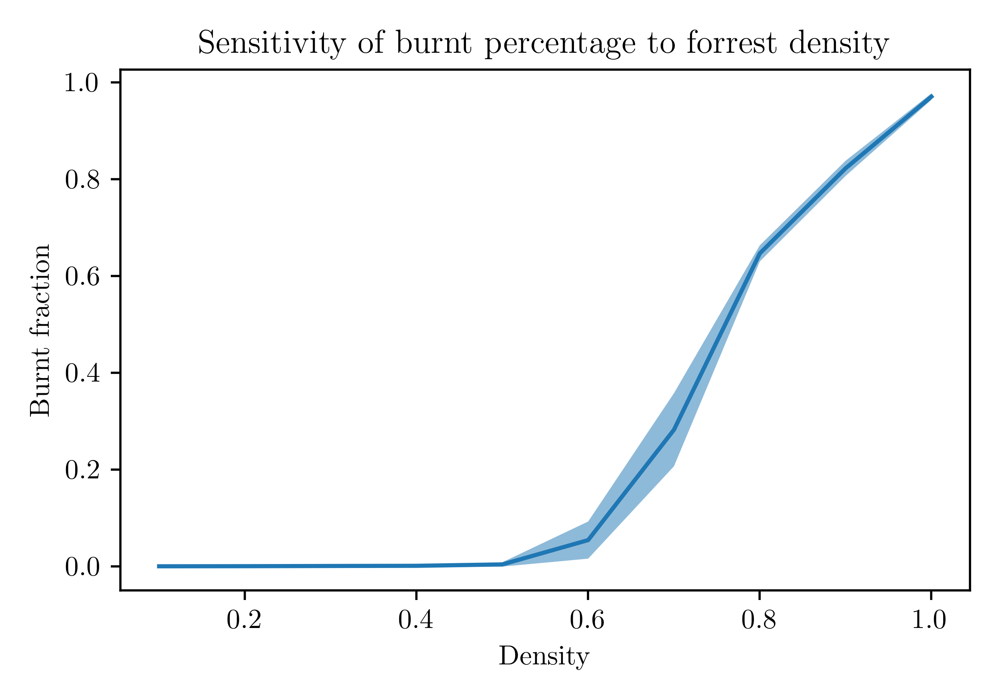

## Model Theory 3: Calibration and Sensitivity Analysis

We have seen what a useful model should contain, and how to conduct an experiment. 

<!-- Een van de belangrijkste testen die we met onze modellen uitvoeren is _sensitivity analysis_. We willen hiermee uitzoeken hoe gevoelig de output van ons model is voor veranderingen in de input parameters. Hiermee kan je een aantal zaken bestuderen:

- Je kan kijken of het model goed is gedefinieerd. Misschien is het model niet gevoelig genoeg, of té gevoelig voor een bepaalde parameter. Daar kan je het model wellicht op aanpassen.

- Als je vertrouwen hebt in het model, kan je het gebruiken om te kijken welke factoren van belang zijn in het model, en dus in het echte systeem. Het is dan een mooie manier om een experiment vorm te geven!

Sensitivity analysis is een vakgebied op zich en we zullen ons alleen wagen aan de simpelste vorm: One Factor at a Time (OFAT). Hier laten we één variabele variëren, terwijl we de rest constant houden. Vervolgens kijken we hoe onze afhankelijke variabele (de variabele waar we in geintereseerd zijn) verandert. Let hierbij op het volgende:

- Zoals we eerder zagen, zijn ABM's vrijwel altijd stochastisch, wat dus betekent dat de resultaten altijd (een beetje) anders zullen zijn, ook als je met precies dezelfde parameters simuleert. Één simulatie _per waarde_ van de parameter is dus **niet** genoeg. We zullen dus meerdere keren per waarde moeten simuleren en daar gemiddelden (en liefst ook standaardafwijkingen) van nemen.

- Meerdere runs draaien en de data juist opslaan is vaak ingewikkelder dan het lijkt. Ook duurt het soms best lang, afhankelijk van de grootte van het model. Begin dus klein en ga pas al je data verzamelen als je zeker weet dat alles goed werkt. Sla ook je data op voordat je gaat plotten. Dan kan je je plotjes nog aanpassen zonder dat je de hele simulatie opnieuw hoeft te doen.

### Voorbeeld: Forest Fire

Hieronder is als voorbeeld een sensitivity analysis van ons forrest fire model geplot. Hier is de afhankelijke (_dependent_) variabele de fractie van het bos dat is afgebrand (burnt fraction), en de onafhankelijke (_independent_) variabele de dichtheid van het bos bij het begin van de simulatie (density).

Uit dit figuur kunnen we al een heel aantal conclusies trekken over ons systeem. Ten eerste zien we dat de afgebrande fractie niet _lineair_ reageert op de dichtheid. Voor alle waarden onder 0.5 gebeurt er niets, waarna er rond 0.5 een _kritiek punt_ bereikt lijkt te zijn, en opeens een groter deel van het bos afbrand.

Dit figuur bevat de _geaggregeerde_ resultaten van het model, dus voor elke waarde voor density is het model meerdere keren gesimuleerd, en hebben we de gemiddelde waarde als lijn geplot. Om aan te geven hoe variabel het model is voor verschillende waarden, is ook de standaardafwijking als band rondom de lijn geplot. De resultaten lijken dus vooral te varieëren tussen dichtheden 0.5 en 0.8.

<!--  -->

<!-- ### Opdracht: Voer SA uit

Als laatste opdracht kies je één van de modellen die je hebt geïmplementeerd en voer je hier een sensitivity analysis op uit.

- Kies daar eerst een onafhankelijke en afhankelijke variabele in het model die jij relevant vindt.

- Kies vervolgens een gepaste interval waarbinnen je de onafhankelijke variabele laat veranderen, en zet een simulatie op.

- Plot tenslotte de resultaten. Je plot moet _ten minste_ de gemiddelde waarden voor een aantal runs bevatten, maar liever ook de standaardafwijking of interkwartiel afstand. Dit is een oefening, dus als je model lang duurt om te runnen zijn een paar simulaties per parameter-waarde voldoende.

Zijn de resultaten zoals je had verwacht? Heb je wat geleerd over je model, of over het systeem dat je hebt gemodelleerd? Maak bij de figuur ook een markdown-bestand aan waarin je je bevindingen kort beschrijft. --> 
