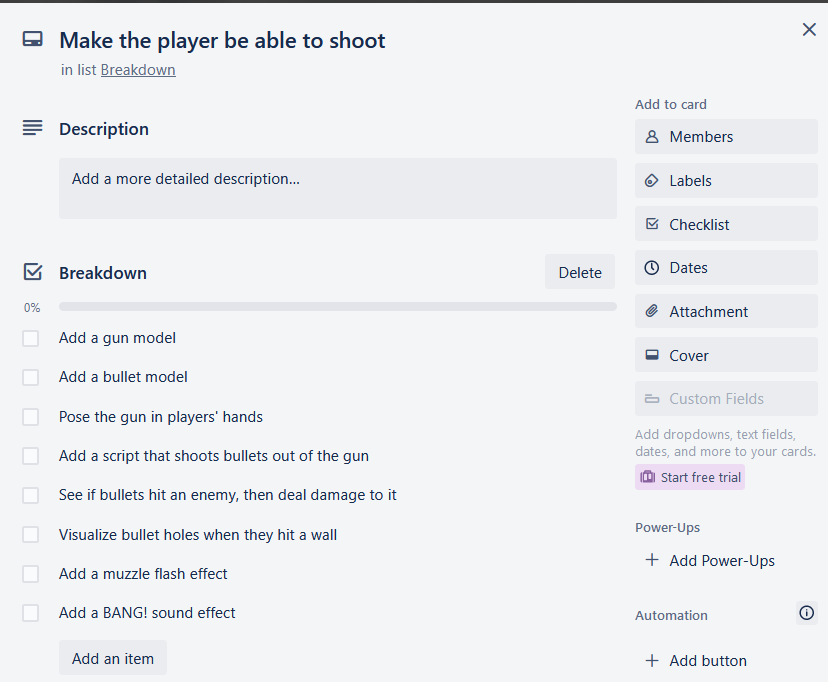

# Agile Development

## Agile Development
Tijdens dit project ga je (met een versimpelde manier van) *[agile development](https://en.wikipedia.org/wiki/Agile_software_development)* werken. Agile werken wordt tegenwoordig veel gebruikt in software ontwikkeling. In plaats van de *waterval methode*, waarbij een klant één waslijst aan eisen inlevert en je daar naar toe werkt, ga je op een iteratieve manier aan de slag. Je projectperiode wordt onderverdeeld in een aantal 'sprints'. Elke sprint werk je naar een 'minimum viable product (MVP)' toe. Dit is een product wat je aan je klant (in dit geval jezelf, of medestudenten) kan laten zien om feedback op te krijgen. Op basis van de feedback pas je zo continu de einddoelen van het product aan.

- Sprint 0: Intro Unity (Nog niet agile)
- Sprint 1: Prototype
- Sprint 2: Alpha
- Sprint 3: Beta
- Sprint 4: Eindproduct

Een handige tool om te gebruiken bij Agile Development is [Trello](https://trello.com/). Maak hierop een board 'Sprint 1' aan en voeg je TA toe als teammember. Op het board plaats je de volgende lijsten:
`Backlog`, `Doing`, `Testing`, `Done`, en `Icebox`.

In de `Backlog` lijst plaats je alle taken die je deze sprint wilt uitvoeren. Bijvoorbeeld:

Wanneer je een taak gaat oppakken, sleep je deze naar je `Breakdown` en onderverdeel je de taak in alle subtaken:

Als je aan de slag gaat, sleep je de taak naar `Doing`. Heb je alles af, dan gaat de taak naar `Testing`  en loop je na of alles werkt zoals het zou horen. Vervolgens sleep je de taak naar `Done`, tenzij de taak óf weer terug moet naar `Breakdown`, in het geval dat er nog iets gefixt moet worden, óf naar de `Icebox`, wanneer duidelijk is geworden dat deze taak te veel tijd gaat kosten om te implementeren. De `Icebox` is namelijk een plek waar je alle taken bewaart die je misschien later nog wilt oppakken, maar geen onderdeel gaan uitmaken van je MVP deze sprint.

Wanneer een nieuwe sprint aanbreekt neem je alle resterende taken uit de `Backlog` en `Icebox` over op een nieuw sprint board. 

Het lijkt misschien een hoop gedoe om over te stappen naar deze manier van werken, maar het is een bewezen effectieve manier om je projecten te managen. Het onderverdelen van elke taak in subtaken geeft je hoofd ook wat rust, je hoeft je vervolgens maar steeds één klein taakje op te pakken in plaats van een te grote taak waarbij je het overzicht verliest. 